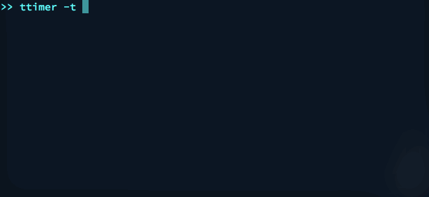

# ttimer - Terminal Timer

`ttimer` is a simple timer that counts down time left in a terminal window. If run on Mac, Windows, or desktop Linux, it will send silent system notifications at 90% and 100% completion.



## Installing

### macOS

```
brew install drgrib/tap/ttimer
```

#### Upgrading

To get the latest version after installing with `brew`, use

```
brew upgrade ttimer
```

### go get

```
go get github.com/drgrib/ttimer
```

To make it accessible on the command line as `ttimer`, assuming you've added `$GOPATH/bin` to your `$PATH`, you can use

```
cd $GOPATH/src/github.com/drgrib/ttimer
go build
go install
```

## Duration Timing

Lets say you want a timer for 3 minutes. Simply enter

```
ttimer 3
```

and you will start a timer count down like so

```
== 3m Timer ==
2m55s
```

Or if you want a very specific duration, you can specify it using

```
ttimer 3h2m5s
```

Or if you want a very short time

```
ttimer 30s
```

## End Time Timing

Let's say you need to leave for the bus by *8:12 am*, which is coming up in the next hour. You could simply enter

```
ttimer 812
```

and `ttimer` will automatically infer the next occurence of `8:12`, which is `am`

```
== 812a Timer ==
23m29s
```

If you want to force it to set a timer for *8:12 __pm__*, you could use

```
ttimer 812p
```

Resulting in something like

```
== 812p Timer ==
12h22m25s
```

If you want a timer for *3:00 pm*, you could simply enter

```
ttimer 3p
```

All end time timers are set to align to zero seconds on the minute so they will change over to new minutes with the system clock.

## Parsing Rules

* Integers less than `100` and floats will be interpretted as minutes.
* Strings fitting a call to [`time.ParseDuration`](https://golang.org/pkg/time/#ParseDuration) will be interpretted as that duration. E.g. `1m30s` or `2h`.
* Strings ending in `a`, `p`, `am`, or `pm` will be interpretted as times. E.g. `1p` or `930a`.
* Integers greater than or equal to `100` will be interpretted as times. E.g. `242` will be interpretted as the next occurence of `2:42` and set to `am` or `pm`, whichever is soonest.

## Exiting

To exit the timer at any time, simply press `q`.

## Auto Exit

To make the timer automatically exit after finishing, pass the `-q` argument like this

```
ttimer -q 30s
```